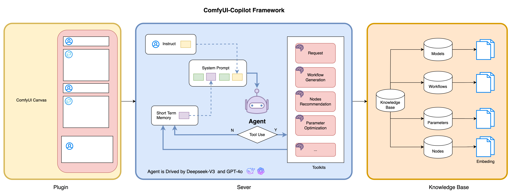
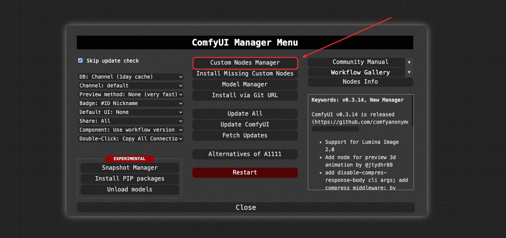
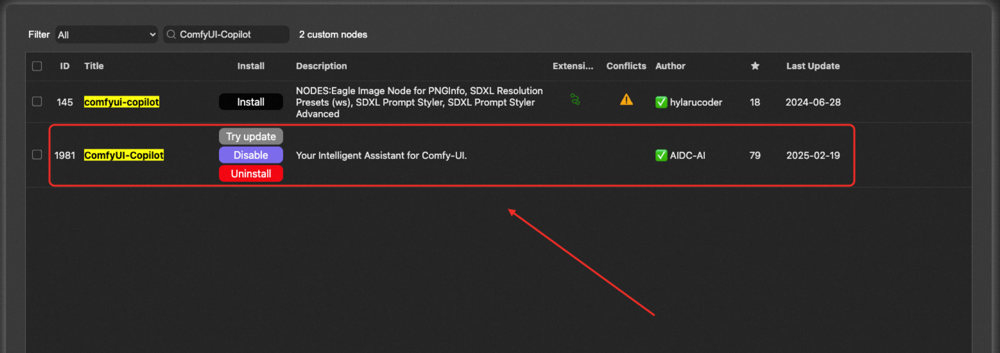
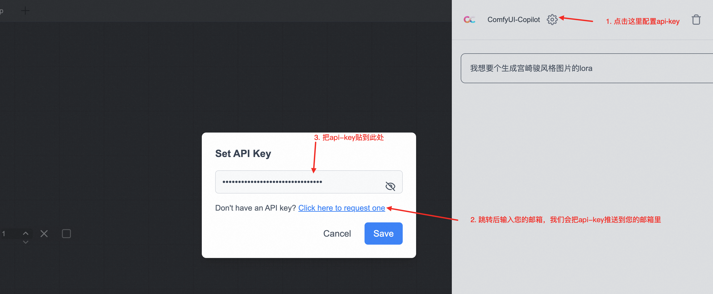

中文 ｜ [English](./README.md)

<div align="center">

# 🎯 ComfyUI-Copilot: 您的智能 ComfyUI 助手

<h4 align="center">

<div align="center">
 


</h4>

👾 _**阿里巴巴国际数字商业集团**_ 👾

<p align="center">
          :octocat: <a href="https://github.com/AIDC-AI/ComfyUI-Copilot"><b>Github</b></a>&nbsp&nbsp | &nbsp&nbsp 📑 <b>说明文档</b> &nbsp&nbsp  | &nbsp&nbsp 💬 <b>微信</b>&nbsp&nbsp
</p>

</div>

https://github.com/user-attachments/assets/0372faf4-eb64-4aad-82e6-5fd69f349c2c

## 🌟 介绍

欢迎使用 **ComfyUI-Copilot**，这是一个基于 ComfyUI 框架构建的智能助手，通过自然语言交互简化并增强 AI 算法调试和部署过程。

无论是生成文本、图像还是音频，ComfyUI-Copilot 都提供直观的节点推荐、工作流构建辅助和模型查询服务，以简化您的开发过程。

<div align="center">

</div>

---

## 🤔 为什么选择 ComfyUI-Copilot？

- 🍀 **易于使用**：通过自然语言交互降低入门门槛，使 Comfy-UI 即便对初学者也能轻松上手。
- 🍀 **智能推荐**：利用 AI 驱动的节点建议和工作流实现来提高开发效率。
- 🍀 **实时帮助**：享受全天候互动支持，以解决开发过程中遇到的任何问题。

---

## 🔥 核心功能

- 💎 **互动问答机器人**：访问强大的问答平台，用户可以轻松询问模型细节、节点详情和参数使用。
- 💎 **自然语言节点建议**：使用我们先进的搜索机制快速找到所需节点，提高工作流构建效率。


- 💎 **节点查询系统**：深入探索节点，查看其说明、参数定义、使用技巧和下游工作流推荐。


- 💎 **智能工作流助手**：自动识别开发者需求，推荐并构建合适的工作流框架，减少手动设置时间。


- 💎 **模型查询**：根据需求提示 Copilot 查找基础模型和 'lora'。
- 💎 **即将推出的功能**：
  
  - **自动参数调整**：利用机器学习算法无缝分析和优化关键工作流参数。
  - **错误诊断和修复建议**：获取全面的错误见解和修正建议，以快速定位和解决问题。

---

## 🚀 快速开始

**仓库概览**：访问 [GitHub 仓库](https://github.com/AIDC-AI/ComfyUI-Copilot) 以获取完整代码库。

1. **安装**：
   
   ```bash
   cd ComfyUI/custom_nodes
   git clone git@github.com:AIDC-AI/ComfyUI-Copilot.git
   ```
   
   或
   
   ```bash
   cd ComfyUI/custom_nodes
   git clone https://github.com/AIDC-AI/ComfyUI-Copilot
   ```

   或
   
   **使用 ComfyUI 管理器**：打开 ComfyUI 管理器，点击自定义节点管理器，搜索 ComfyUI-Copilot，并点击安装按钮。
   
   

2. **激活**：在运行 ComfyUI 项目后，在面板右上角找到 Copilot 激活按钮以启动其服务。


3.  **KeyGeneration**：在链接中输入您的电子邮件地址，api-key 将稍后自动发送到您的电子邮件地址。


---

## 🤝 贡献

我们欢迎任何形式的贡献！可以随时提出 Issues、提交 Pull Request 或建议新功能。


## 📞 联系我们

如有任何疑问或建议，请随时联系：ComfyUI-Copilot@service.alibaba.com。


## 📚 许可证

该项目采用 MIT 许可证 - 有关详情，请参阅 [LICENSE](https://opensource.org/licenses/MIT) 文件。

## ⭐ 星标历史

[](https://star-history.com/#AIDC-AI/ComfyUI-Copilot&Date)
